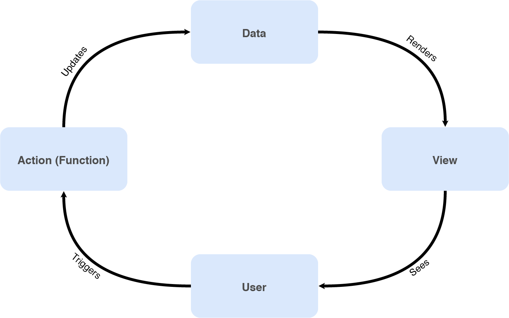
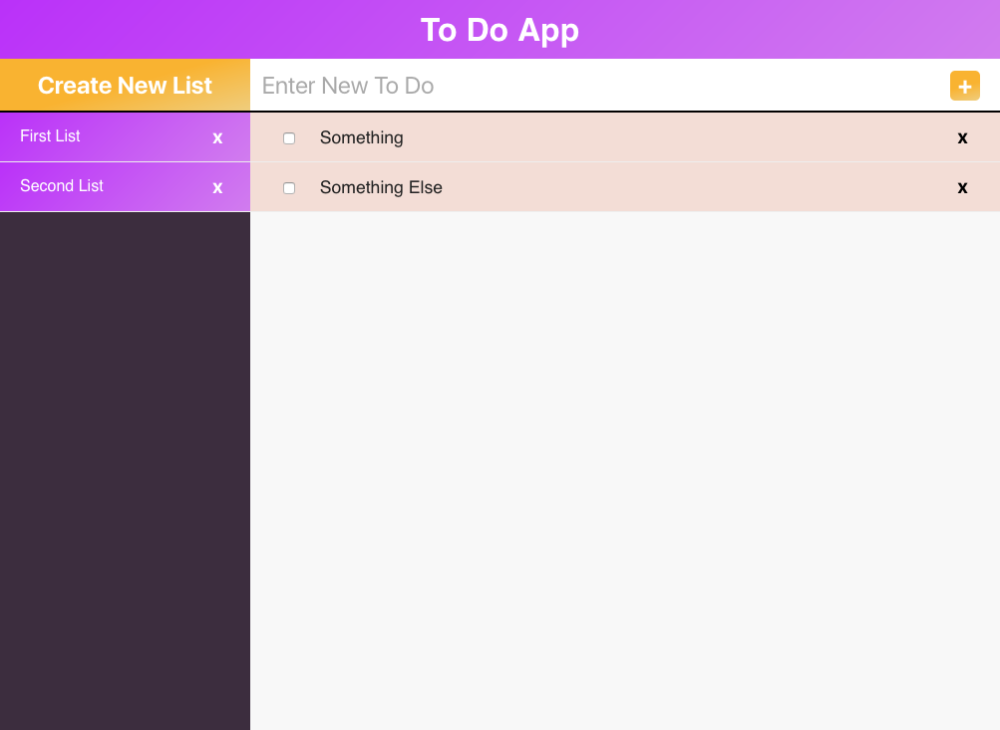

# Pillars of Javascript: Everything is a function
## Outline

### Objective

* Know how to get started building an app interface
* build a modest template engine
* Have code split into separate files and run a build task
* Use a module system with our JS code

### Technologies used

* CSS Layout with Flex
	* display: flex and other flex properties
	* background-image: gradient
* HTML markup
	* div
	* template or `<script type=“x-template”>`
* Javascript
	* Language
		* Function and arrow functions
		* Spread, Rest operators
		* Template Strings
	* DOM
		* querySelector()
		* node.outerHTML
* Gulp
	* browserSync
	* browserify
	* clean
	* babel
	* usemin
		* rev
		* uglify
		* postcss
			* nested
			* autoprefixer
			* cssnano


### Design Patterns
* Keep Code Modular
* Clean Code Concepts
	* BEM
* Functional Programming
	* Immutable Data
	* Pure functions
	* Higher Order Functions
* Part of Dependency Injection
* Views as Template Functions

### What we will do
* Build a simple todo app laid out HTML CSS and Javascript
* Refactor the app to modules
	* JS functions
	* CSS BEM
	* HTML template tags
* Execute a build task to concatenate everything into single files
* Rewrite  app to use browserify


## Pre Session
Read [Clean Code concepts adapted for JavaScript](https://github.com/ryanmcdermott/clean-code-javascript)

## Session
In the following 2 sessions we will be building an app following this mental model.




## Exercise (4 Parts)

Build the following interface without any external library.



> The design does not need to be precise, however you have to use  [Flexbox](https://css-tricks.com/snippets/css/a-guide-to-flexbox/) while implementing your layout,.  

> No `float` or `position:absolute` is allowed  

### Part 1: User sees the View

One way to start a design is to build our interface as pure HTML and CSS.

#### 1. Structure your interface’s HTML

Before starting out plan your design by segmenting the interface into it’s individual parts,  here we can say we have the following structure

    * header
    * navigation/todo list list
    	* create list button
    	* list of lists
        * title
        * delete button
    * main-content or selected to-do list
    	* create to-do
        * text input
        * add button
    	* list of to-dos
        * checkbox
        * text
        * delete button

#### 2. Separate your CSS into modules

* Use [BEM 101 | CSS-Tricks](https://css-tricks.com/bem-101/) to maintain modularity of your CSS

The reason we encourage using BEM is because overtime project code tends to get larger and larger and without clear classes other developers will not understand intuitively when to apply your class and wether to modify it our not.

* Split CSS related to each component into its own file

This may seem silly at first but again, over time your fils will grow, that said, this is only a step before we segment our app into components

You should have something like this

```html
<link rel="stylesheet" href="/css/base.css">
<link rel="stylesheet" href="/css/layout.css">
<link rel="stylesheet" href="/css/header.css">
<link rel="stylesheet" href="/css/navigation/navigation.css">
<link rel="stylesheet" href="/css/navigation/create-list.css">
<link rel="stylesheet" href="/css/navigation/todo-list-list.css">
<link rel="stylesheet" href="/css/todo-list/create-todo.css">
<link rel="stylesheet" href="/css/todo-list/todo-list.css">
<link rel="stylesheet" href="/css/todo-list/todo-item.css">
```

### Part 2: Data renders the View

> In case you have not been following along, a version of the todo app interface is available on the repo hosting this project.  

Now that we have an interface to render we need to talk about state.

Fundamentally in any app the _User_ wants to _Act_ on some _Data_ represented in the interface as a _View_.

We call the data that governs the view the _State_

We want to think of our app as one big function, that takes as input an interaction from the user, and outputs an interface for him to see.

Building on that instead of thinking of our app as HTML that I need to select part of with JavaScript and attach event handlers too. So that when a click event happens for example I update the HTML.

It is far easier and more efficient as it will turn out, to think of my app as data. And that the events and view being rendered as just middle steps between the user directly manipulating the data and getting feedback.

> Side note: we call the data that represents the state of our app or component _State_ and we store data in a _Store_  

* Think about the data that is being manipulated/displayed by this interface
	* your app has a list of to-do lists
	* each one of those lists has a title and a list of to-do items
	* each to-do item has properties such as done and text
You could say you have 3 models inside your store
	* _TodoListList_
	* _TodoList_
	* _TodoItem_

```js
// js/app.js
let state = {
	“todo_list_list”: [
  	{
			“title”: “First List”,
			“items”: [
				{
					“text”: “Something”,
					“done”: false
				},{
					“text”: “Something else”,
					“done”: true
				}
			]
		},
		{
			“title”: “Second List”,
			“items”: [
				{
					“text”: “item 1”,
					“done”: false
				},{
					“text”: “item 2”,
					“done”: false
				}
			]
		}
  ]
}
```

Now all we need to do is write code that renders this data as HTML

##### Rendering Data to HTML

What we want to do is have a render function that takes the state as input and outputs HTML as string.

We will then take the output string and append it to the DOM, for example.

Assuming this html view

```html
<html>
	<head>
	</head>
	<body>
		<header class="message">
			<h1>Hello World</h1>
		</header>
	</body>
</html>
```

I can select in my app the `h1` and re-render it using my render function as follows.

```js
// js/main.js

let messageContainer = document.querySelector('.message')

let state = {
	message: "Hello World"
}

let html = renderState(state) // outputs <h1>Hello World</h1>

messageContainer.innerHTML = html

```

>  document.querySelector() allows us to select elements in the DOM using CSS styled selector this is what jQuery uses internally in browsers past IE8  

Our `renderState()` does the following

```js
function renderState(state) {
   return `<h1>${state.message}</h1>`
}
```

> This statement `<h1>${state.message}</h1>` between backquotes is equivalent to `”<h1>”+state.message+”</h1>”`  

> Anything between `${1+2}`  is evaluated as a JavaScript expression.  

If we want to render a list  of items.

```html
<ul>
	<li>Message 1</li>
	<li>Message 2</li>
	<li>Message 3</li>
</ul>
```

We can think that we are rendering an array of the form

```js
messages = ['Message 1', 'Message 2', 'Message 3']
messages.map(message=>`<li>${message}</li>`)
// outputs => ['<li>Message 1</li>', '<li>Message 2</li>', '<li>Message 3</li>']
```

And therefor to render the html we would say

```js
function renderMessages(messages) {
	return `<ul>
		${messages.map(message=>`<li>${message}</li>`)}
	</ul>`
}
```

Assuming we now want to render this view

```html
<--! index.html -->
<html>
	<head>
	</head>
	<body>
		<header class="message">
			<h1>Hello World</h1>
		</header>
		<sidebar class="messages">
			<ul>
				<li>Message 1</li>
				<li>Message 2</li>
				<li>Message 3</li>
			</ul>
		</sidebar>
	</body>
</html>
```

Then our app code now looks like this

```js
// js/main.js
let state = {
	message: "Hello World",
}
let messageContainer = document.querySelector('.message')
messageContainer.innerHTML  = renderState(state)

function renderState(state) {
   return `<h1>${state.message}</h1>`
}

let messages = ['Message 1', 'Message 2', 'Message 3']

let messagesContainer = document.querySelector('.messages')
messagesContainer.innerHTML  = renderMessages(messages)

function renderMessages(messages) {
	return `<ul>
		${messages.map(message=>`<li>${message}</li>`)}
	</ul>`
}
```

Of course writing code like this doesn’t scale well. It helps to once again _compose_ our code into components.

And have our **components** be aware of how they **should render there part of the state**.

let’s imagine we can split  this view

```html
<--! index.html -->
<html>
	<head>
	</head>
	<body>
		<header class="header">
			<h1>Hello World</h1>
			<h1>The world is a beautiful place</h1>
		</header>
		<sidebar class="messages">
			<ul>
				<li>Message 1</li>
				<li>Message 2</li>
				<li>Message 3</li>
			</ul>
		</sidebar>
	</body>
</html>
```

Into

```html
<--! index.html -->
<html>
	<head>
	</head>
	<body>
		<App>
			<Header>
			<Messages>
		</App>
	</body>
</html>
```

where Header is an object with render function

```js
// js/header.js
let Header = {
	render(header){
		return `<h1>${header.title}</h1>
		<h1>${header.subtitle}</h1>`
  }
}
```

Messages is an object with a render function

```js
// js/messages.js
let Messages = {
	render(messages){
		return `<ul>
			${messages.map(message=>`<li>${message}</li>`)}
		</ul>`
  }
}
```

and App is an object that calls Messages and Header in its render function

```js
// js/app.js
let App = {
	render(state){
		return `<header>
			${Header.render(state.header)}
		</header>
		<sidebar>
			${Messages.render(state.messages)}
		</sidebar>`
  }
}
```

And now our main.js file looks like this

```js
// js/main.js
let state = {
	header: {
		title:"Hello World",
		subtitle:"The world is a beautiful place"
	},
  messages: ['Message 1', 'Message 2', 'Message 3']
}
document.body.innerHTML = App.render(state)
```


> Side Note: while we do render the entire app in the body, it is perfectly viable to render  the data to only part of the html as in the previous examples.  


**Create an App object that renders the todo app interface from its state**  

```js
// js/main.js
let state = {
	“todo_list_list”: [
  	{
			“title”: “First List from JS”,
			“items”: [
				{
					“text”: “Somthing from JS”,
					“done”: false
				},{
					“text”: “Something else from JS”,
					“done”: true
				}
			]
		},
		{
			“title”: “Second List from JS”,
			“items”: [
				{
					“text”: “item 1 from Js”,
					“done”: false
				},{
					“text”: “item 2 from JS”,
					“done”: false
				}
			]
		}
  ]
}
document.body.innerHTML = App.render(state)
```

By the end of this section you should have something that looks like this.

```html
<script type="text/javascript" src="js/todo-list-list.js"></script>
<script type="text/javascript" src="js/todo-item.js"></script>
<script type="text/javascript" src="js/todo-list.js"></script>
<script type="text/javascript" src="js/app.js"></script>
<script type="text/javascript" src="js/main.js"></script>
```

### Part 3: Build scripts

While we did separate our code into several files, in production we would carry out some optimisation steps.

**Create a a build task that runs our development environment and concatenates the files in the project and produces a build folder for our production code**

### Part 4: JS Modules

Global variables are bad, to control them we will encapsulate our code into modules. This section will walks us through the module pattern and why it’s important.


**Refactor the project to use browserify with gulp**


## Next Session
We will talk about Data binding such that when we update our data the view gets re-rendered.

* [Event loop](https://blog.risingstack.com/writing-a-javascript-framework-execution-timing-beyond-settimeout/)
* The Observer pattern
* Data binding
* Virtual DOM
