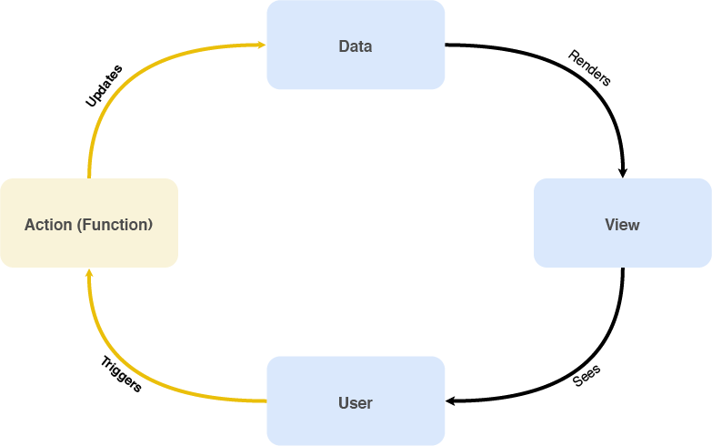

# Pillars of JavaScript: Observed actions

## Outline

### Objective

* Continue building our app
* DOM Events
* Update state through actions
* Know and understand the Observe Pattern

### Technologies used

* HTML markup
* Javascript
	* Language
		* Function and arrow functions
		* Spread, Rest operators
	* Observer


### Design Patterns
* Keep Code Modular
* IIFE
* Observer Pattern

### What we will do
* Discuss Events
* Talk about the observer pattern
* Define the actions in our app
* Use the Observer to publish actions
* Use Observer to subscribe to actions ad handle how state changes
* Render the view after mutating the state

## Pre Session
[Three Principles · Redux](http://redux.js.org/docs/introduction/ThreePrinciples.html)

## Session



In this session we will talk about the left half of our app cycle

By the end of our last session we had created the interface of an app that is rendered from data.

### Events trigger functions

We now want to add interactivity to our application.

The browser has a large set of predefined events that we can attach to DOM elements in our interface and call functions with [you can check out a list here](https://developer.mozilla.org/en-US/docs/Web/Events)

We can attach events to our DOM directly

```html
<body>
<button onclick="alert(`${this.textContent} says Hello There`)">Click Me Button</button>
</body>
```

or programatically

```html
<body>
<button>Click Me Button</button>
<script>
	let element = document.querySelector('button');
	element.addEventListner('click', function (event) {
	  alert(`${this.textContent} says Hello There`);
	})
</script>
</body>
```

When a DOM event is triggered the function assigned is called with an argument `event` and the function’s  `this ` refers to the element’s DOM node that triggered the event.

The following code is equivalent

```html
<body>
<input class="test" onchange="state.message=this.value" />
<script>
  let state = {
     message: "Hello"
   }
</script>
</body>
```

```html
<body>
<input class="test" />
<script>
  let state = {
     message: "Hello"
   }
  let selectedElement = document.querySelector('test')
  selectedElement.addEventListner('change', function () {
    state.message = this.value
  })
</script>
</body>
```

> To inspect whether this code works right click, select inspect, element, open the console and type `state`  

An input’s **value** attribute is the text written in the input
The `change` event is triggered every time the input value changes.

#### How we do it

In our model of application design we render the entire application programmatically like this

```html
<body>
<div id='appContainer'></div>
<script>
let appContainer = document.querySelector('#appContainer')
let App = {
  render(state) {
    return `
    <h1>${state.message}</h1>
    <input onchange="globalState.message=this.value;" />
    <button onclick="globalRender()">Re-render</button>
    `
  }
}
let globalState = {
   message: 'Hello'
}

globalRender()

function globalRender() {
  appContainer.innerHTML = App.render(globalState)
}
</script>
</body>
```

Since we are rendering strings by attaching them into the innerHTML attribute of our element’s DOM Node. We can not select the element and add events to it. We can however have the event call functions we define.

 [You can checkout a live version of this example here](https://jsbin.com/vajomed/7/edit?html,output)

###  Scoping our code

It is bad practice to introduce global variables in our application.

> Global variables are bad because they can be accidentally modified by another part of our code if we’re not careful.  

One simple way to avoid this is to **scope** our variables through the use of an Immediately-Invoked Function Expression (IIFE)

```js
// Immediately-Invoked Function Expression (IIFE)
(function main() {
  let appContainer = document.querySelector('#appContainer')
  ...
  ...
  ...
  // not actually global anymore
  let globalState = {
      message: 'Hello'
  }
  ...
  ...
  ...
  // now scopedRender function
  function globalRender() {
     appContainer.innerHTML = App.render(globalState)
  }
})()
```

If you modify the example we used previously to use the IIFE the code will stop working. If you [checkout the console by Running JS](https://jsbin.com/vajomed/8/edit?html,console,output) you will see that an error is shown whenever you click on the button or modify the input value.

Scoping our application like this  prevents our HTML from accessing the previously _global_ variables we declared.

In order to intentionally **export** global variables to our window object.
We pass the `window` object  to our main function as  `global`.
As a convention we will
* Import at the start of our script the variables we want to use.
* Attach at the end of our script the variables we want to export.

```js
// main.js
(function main(global) {
  let document = global.document
  // scoped variable no one can access this
  let appContainer = document.querySelector('#appContainer')
  ...
  ...
  ...
  let scopedState = {
      message: 'Hello'
  }
  ...
  ...
  ...
  // now scopedRender function
  function globalRender() {
     appContainer.innerHTML = App.render(scopedState)
  }
  global.globalState = scopedState
  global.globalRender = globalRender
})(window)
```

[Our example now looks like this](https://jsbin.com/vajomed/10/edit?html,output)

### The Observer Pattern

> The observer pattern is a software design pattern in which an object, called the subject, maintains a list of its dependents, called observers, and notifies them automatically of any state changes, usually by calling one of their methods. — [Observer pattern - Wikipedia](https://en.wikipedia.org/wiki/Observer_pattern)  

The Observer pattern is used when there is one-to-many relationship between objects such as if one object is modified, its dependent objects are to be notified automatically.

Think of how in [This Spreadsheet](https://docs.google.com/spreadsheets/d/1uPVvmdVu5Vo285wChCn8AWrTyJZvnZQVGMGGlPPR9mo/edit?usp=sharing)  cell `B8` is set to the sum of (`B2:B7`), if any of `B2` to `B7` is changed `B8` will also automatically update.

In any system we can use a single Subject calling it the Observer, Mediator, or EventEmitter.

The Observer subject fundamentally as an API is an object that implements the following methods.

```js
let Observer = {
  // add a subscriber (a function)
	// to the array of subscribers to the event
	subscribe(event, subscriber) {},
  // remove a subscriber (a function)
	// from the array of subscribers of the event
	unsubscribe(event, subscriber) {},
  // loop over array of functions subscribed to this event
	// and call them with arguments
	publish(event, args) {}
}
```

Other names for the `subscribe` function can be `on`
Other names for the `unsubscribe` function can be `of`
Other names for the `publish` function can be `trigger` `emit`   

You can find an implementation with an example of something similar to our spreadsheet example [here](http://www.webpackbin.com/VJjqPLMtM)

You will notice that if you change B1 or B2, Sum is automatically updated.

### Actions update the State

In our application model the state should be read only.

This means that in order to update the state of the app it can only be done Through an action.

So now our app can be

```html
<body>
    <div id="appContainer">
        <h1>Hello</h1>
	    <input onchange="App.updateMessage(this.value)" />
	    <button onclick="App.saveMessage()">Re-render</button>
    </div>
    <script src="observer.js"></script>
    <script src="app.js"></script>
    <script src="main.js"></script>
</body>
```

```js
// main.js
(function main(global) {
  let { document, Observer } = global

	let appContainer = document.querySelector('#appContainer')

	let state = {
	   message: 'Hello'
	}

  Observer.subscribe('action', (action)=>{
		switch(action.type) {
		case 'SAVE_MESSAGE':
			state.message = action.message
			break;
		}
		Observer.publish('state.change', state)
	})

  Observer.subscribe('state.change',
		(newState) => render(newState)
	)

	function render(state) {
	  appContainer.innerHTML = App.render(state)
	}
})(window)
```

```js
// app.js
(function app(global) {
  let Observer = global.Observer
	let App = {
	  localState: {},
	  render(state) {
	    return `
	    <h1>${state.message}</h1>
	    <input onchange="App.updateMessage(this.value)" />
	    <button onclick="App.saveMessage()">Re-render</button>
	    `
	  },
    updateMessage(message) {
		this.localState.message = message
	  },
	  saveMessage() {
	    Observer.publish('action', {
			type: 'SAVE_MESSAGE',
			message: this.localState.message
		})
	  }
	}
  global.App = App
})(window)
```

You can find an example of this code [here]( http://www.webpackbin.com/NJp_Z5GFG)

**Implement all actions in our ToDo App**

In our todo app you have the following events

- [ ] `ADD_LIST`
- [ ] `REMOVE_LIST`
- [ ] `SELECT_LIST`
- [ ] `ADD_ITEM`
- [ ] `REMOVE_ITEM`
- [ ] `TOGGLE_DONE_ITEM`
